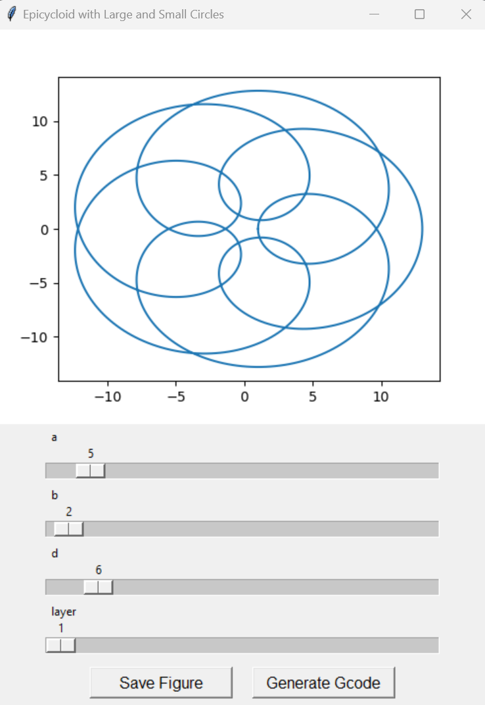

# DM-food-printing

A custom G-code generator script for Fused Deposition Modeling (FDM) based 3D food printing.

## Overview

This Python script offers a GUI to design patterns based on the epicycloid curve. Once a pattern is visualized, users can generate the corresponding G-code required for FDM 3D printing, particularly tailored for food printing.

## Features

- GUI built using `Tkinter`
- Visualizes the epicycloid curve based on adjustable parameters for large and small circle radii, and the distance from the center
- Allows the user to save the visualized pattern as an image
- Generates custom G-code suitable for FDM based 3D food printers

## How to Use

1. Run the script.
2. Adjust the sliders to modify the parameters of the epicycloid curve.
3. Visualize the pattern in real-time on the GUI.
4. Save the visualized pattern as an image if required.
5. Generate the G-code for the pattern and save it to your desired location.

## Code Structure

The code consists of a primary `EpicycloidGUI` class that manages the GUI elements, plot generation, and G-code generation. 

- The `epicycloid` function computes the (x, y) coordinates for the curve.
- Sliders allow real-time manipulation of the curve parameters.
- `save_fig` allows saving the figure.
- `generate_gcode` is responsible for creating the G-code based on the current curve.

## Requirements

- Python 3.x
- `tkinter`
- `numpy`
- `matplotlib`

